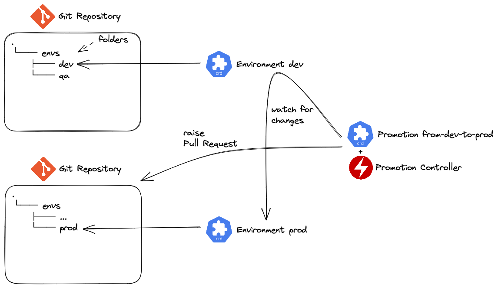
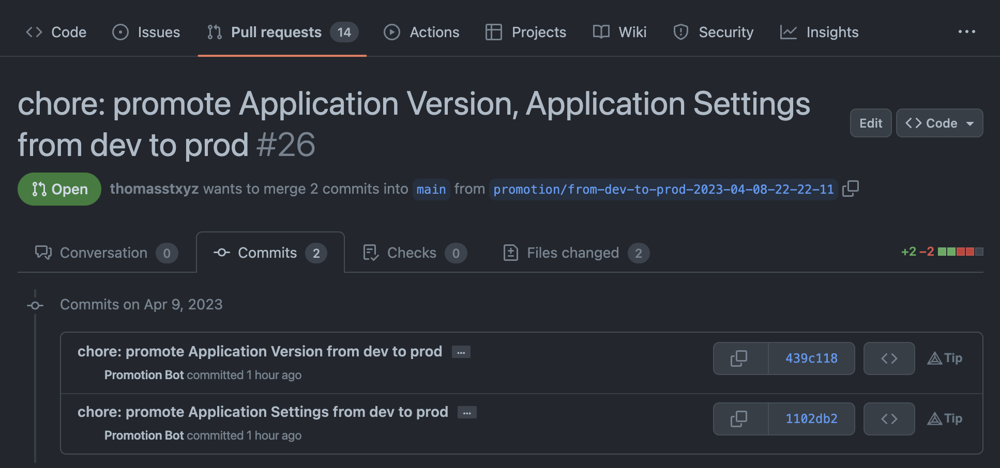
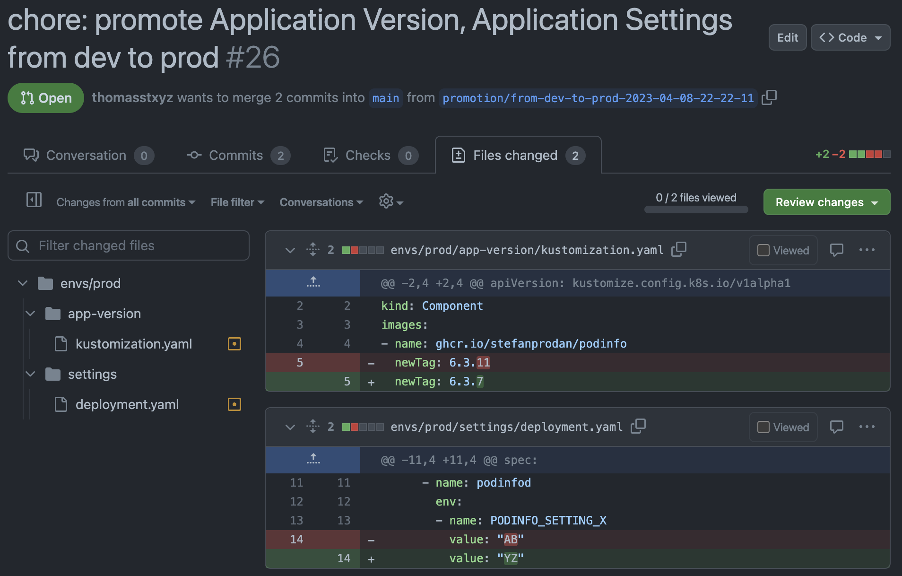

# gitops-promotions-operator

The GitOps Promotions Operator watches Git Repositories (Environments) for changes,
and promotes them to other Environments.



## Getting Started (as a User)

### Install CRDs and Controller

```bash
kubectl apply -k github.com/thomasstxyz/gitops-promotions-operator/config/default
```

### Create an `Environment` for your source environment.

```yaml
apiVersion: promotions.gitopsprom.io/v1alpha1
kind: Environment
metadata:
  name: dev
spec:
  path: ./envs/dev
  source:
    url: https://github.com/thomasstxyz/example-kustomize-overlay-dev
    ref:
      branch: main
```

> If it's a private repository, you must add `.spec.source.secretRef`
> and setup an ssh key pair explained at [Creating an ssh key pair](#creating-an-ssh-key-pair).

### Create an `Environment` for your target environment.

```yaml
apiVersion: promotions.gitopsprom.io/v1alpha1
kind: Environment
metadata:
  name: prod
spec:
  path: ./envs/prod
  source:
    url: https://github.com/thomasstxyz/example-kustomize-overlay-prod
    ref:
      branch: main
    secretRef:
      name: prod-ssh
  apiTokenSecretRef:
    name: github-api-token
  gitProvider: github
```

`.spec.source.secretRef` references a secret which contains an ssh key pair,
follow [Creating an ssh key pair](#creating-an-ssh-key-pair) to set it up.

`.spec.apiTokenSecretRef` references a secret which contains an API Token for the git provider
(GitHub), with permissions to create Pull Requests. This secret can be created with the following command:

```bash
kubectl create secret generic github-api-token --from-literal=token="ghp_n139N..."
```

### Create a `Promotion`

`.spec.copy.source` and `.spec.copy.target` are filesystem paths relative
to `.spec.path` in the `Environment` CR.

```yaml
apiVersion: promotions.gitopsprom.io/v1alpha1
kind: Promotion
metadata:
  name: from-dev-to-prod
spec:
  sourceEnvironmentRef:
    name: dev
  targetEnvironmentRef:
    name: prod
  copy:
  - name: "Application Version"
    source: app-version
    target: app-version
  - name: "Kustomization File"
    source: ./app-version/kustomization.yaml
    target: ./app-version/
  - name: "Application Settings"
    source: settings
    target: settings
  strategy: pull-request
```

Now if there are changes in the source environment,
which differ from the target environment,
the operator will create a pull request.





### Uninstalling

```bash
kubectl delete -k github.com/thomasstxyz/gitops-promotions-operator/config/default
```

## Creating an ssh key pair

Generate an RSA key pair for SSH auth.

```bash
ssh-keygen -b 2048 -t rsa -f key -q -C gitopsprombot -N ""
GITOPSPROMBOT_PRIVATE_KEY=$(cat key)
GITOPSPROMBOT_PUBLIC_KEY=$(cat key.pub)
```

Create a Secret.

```bash
kubectl create secret generic prod-ssh \
--from-literal=private=${GITOPSPROMBOT_PRIVATE_KEY} \
--from-literal=public=${GITOPSPROMBOT_PUBLIC_KEY}
```

The public key needs to be configured as a "deploy key" in the Git Repository.
**If you want to promote to this environment, the deploy key needs write permissions!**
```bash
cat key.pub
```
> Docs about how to configure a deploy key:
> - [GitHub](https://docs.github.com/en/authentication/connecting-to-github-with-ssh/managing-deploy-keys)

When applied to the cluster, you should delete the key from your local machine.

```bash
rm key
rm key.pub
```

## Description

The GitOps Promotions Operator watches Git Repositories (`Environments`) for changes,
and promotes them to other Environments.

This is done by defining `Environment` and `Promotion` custom resources,
as explained it the [Getting Started (as a User)](#getting-started--as-a-user).

## Getting Started (as a Developer)
You’ll need a Kubernetes cluster to run against. You can use [KIND](https://sigs.k8s.io/kind) to get a local cluster for testing, or run against a remote cluster.
**Note:** Your controller will automatically use the current context in your kubeconfig file (i.e. whatever cluster `kubectl cluster-info` shows).

### Running on the cluster
1. Install Instances of Custom Resources:

```sh
kubectl apply -f config/samples/
```

2. Build and push your image to the location specified by `IMG`:

```sh
make docker-build docker-push IMG=<some-registry>/gitops-promotions-operator:tag
```

3. Deploy the controller to the cluster with the image specified by `IMG`:

```sh
make deploy IMG=<some-registry>/gitops-promotions-operator:tag
```

### Uninstall CRDs
To delete the CRDs from the cluster:

```sh
make uninstall
```

### Undeploy controller
UnDeploy the controller from the cluster:

```sh
make undeploy
```

## Contributing
// TODO(user): Add detailed information on how you would like others to contribute to this project

### How it works
This project aims to follow the Kubernetes [Operator pattern](https://kubernetes.io/docs/concepts/extend-kubernetes/operator/).

It uses [Controllers](https://kubernetes.io/docs/concepts/architecture/controller/),
which provide a reconcile function responsible for synchronizing resources until the desired state is reached on the cluster.

### Test It Out
1. Install the CRDs into the cluster:

```sh
make install
```

2. Run your controller (this will run in the foreground, so switch to a new terminal if you want to leave it running):

```sh
make run
```

**NOTE:** You can also run this in one step by running: `make install run`

### Modifying the API definitions
If you are editing the API definitions, generate the manifests such as CRs or CRDs using:

```sh
make manifests
```

**NOTE:** Run `make --help` for more information on all potential `make` targets

More information can be found via the [Kubebuilder Documentation](https://book.kubebuilder.io/introduction.html)

## License

Copyright 2023 Thomas Stadler <thomas@thomasst.xyz>

Licensed under the Apache License, Version 2.0 (the "License");
you may not use this file except in compliance with the License.
You may obtain a copy of the License at

    http://www.apache.org/licenses/LICENSE-2.0

Unless required by applicable law or agreed to in writing, software
distributed under the License is distributed on an "AS IS" BASIS,
WITHOUT WARRANTIES OR CONDITIONS OF ANY KIND, either express or implied.
See the License for the specific language governing permissions and
limitations under the License.

